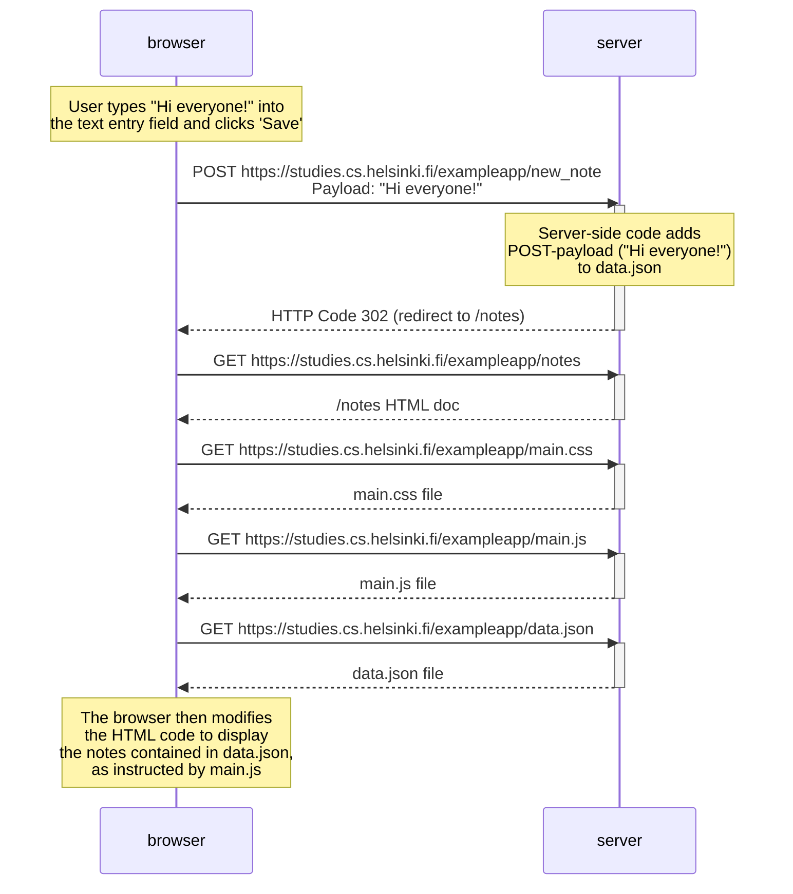

```mermaid
sequenceDiagram
    participant browser
    participant server

    note over browser: User types "Hi everyone!" into<br>the text entry field and clicks 'Save'

    browser->>server:POST https://studies.cs.helsinki.fi/exampleapp/new_note<br/>Payload: "Hi everyone!"
    activate server
    note over server: Server-side code adds <br/>POST-payload ("Hi everyone!")<br/> to data.json
    server-->>browser: HTTP Code 302 (redirect to /notes)
    deactivate server

    
    browser->>server:GET https://studies.cs.helsinki.fi/exampleapp/notes
    activate server
    server-->>browser: /notes HTML doc
    deactivate server

    browser->>server:GET https://studies.cs.helsinki.fi/exampleapp/main.css
    activate server
    server-->>browser: main.css file
    deactivate server

    browser->>server:GET https://studies.cs.helsinki.fi/exampleapp/main.js
    activate server
    server-->>browser: main.js file
    deactivate server

    browser->>server:GET https://studies.cs.helsinki.fi/exampleapp/data.json
    activate server
    server-->>browser: data.json file
    deactivate server

    activate browser
    note over browser: The browser then modifies<br/> the HTML code to display<br/> the notes contained in data.json,<br/> as instructed by main.js
```