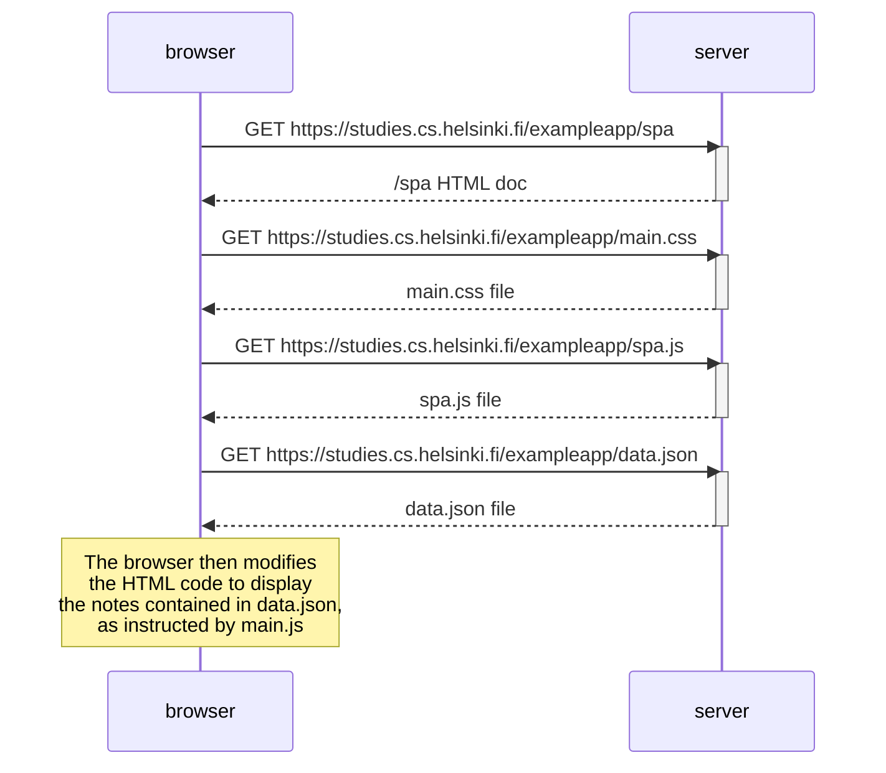

```mermaid
sequenceDiagram
    participant browser
    participant server
    
    browser->>server:GET https://studies.cs.helsinki.fi/exampleapp/spa
    activate server
    server-->>browser: /spa HTML doc
    deactivate server

    browser->>server:GET https://studies.cs.helsinki.fi/exampleapp/main.css
    activate server
    server-->>browser: main.css file
    deactivate server

    browser->>server:GET https://studies.cs.helsinki.fi/exampleapp/spa.js
    activate server
    server-->>browser: spa.js file
    deactivate server

    browser->>server:GET https://studies.cs.helsinki.fi/exampleapp/data.json
    activate server
    server-->>browser: data.json file
    deactivate server

    activate browser
    note over browser: The browser then modifies<br/> the HTML code to display<br/> the notes contained in data.json,<br/> as instructed by main.js
```